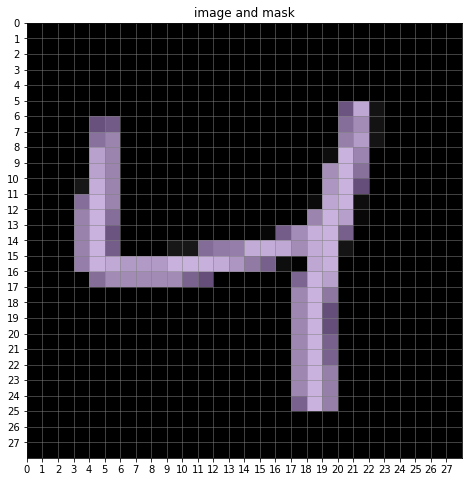
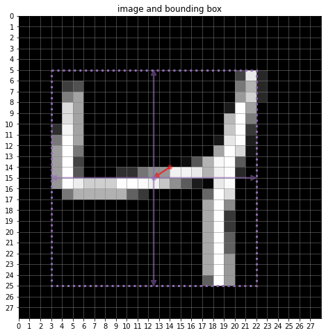
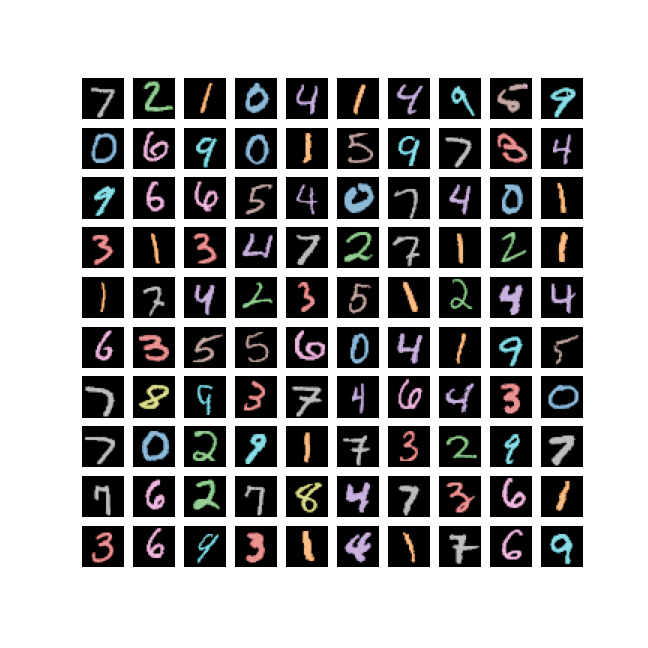
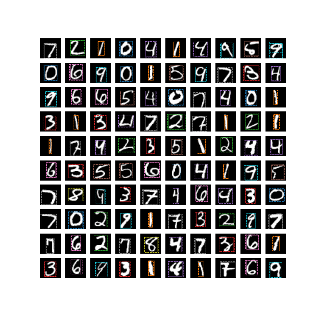

# MNIST Semantic Segmentation and Obkect Detection

PyTorchを使ったシンプルなセマンティックセグメンテーションと物体検出のコードです。

データセットはMNISTを加工して使用します。

<table border="0">
<tr>
<td></td>
<td></td>
</tr>
</table>

## requirements

```
albumentations >= 1.1.0 
jupyter >= 1.0.0
matplotlib >= 3.5.1
torch >= 1.10.1
torchvision >= 0.11.2
```

## Semantic Segmentation

### 推論例



### 学習

```
python learning_segmentation.py
```

### 推論

```
python inference_segmentation.py
```

### 学習と推論のノートブック

```
mnist_segmentation.ipynb
```

## Object Detection

### 推論例



### 学習

```
python learning_detection.py
```

### 推論

```
python inference_detection.py
```

### 学習と推論のノートブック

```
mnist_detection.ipynb
```
